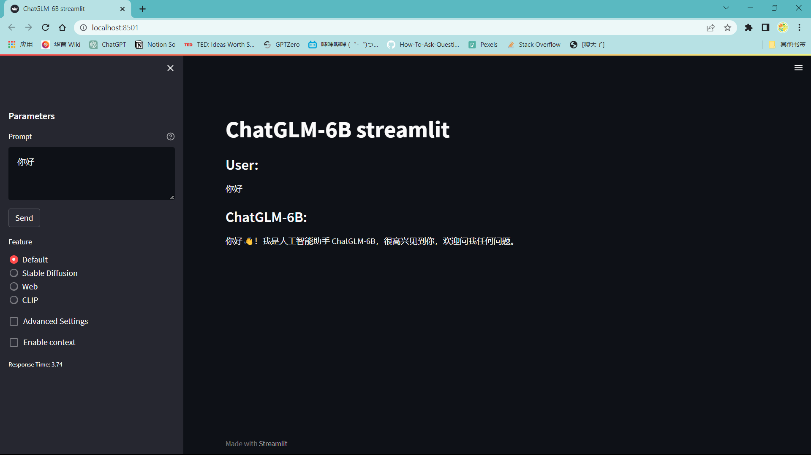
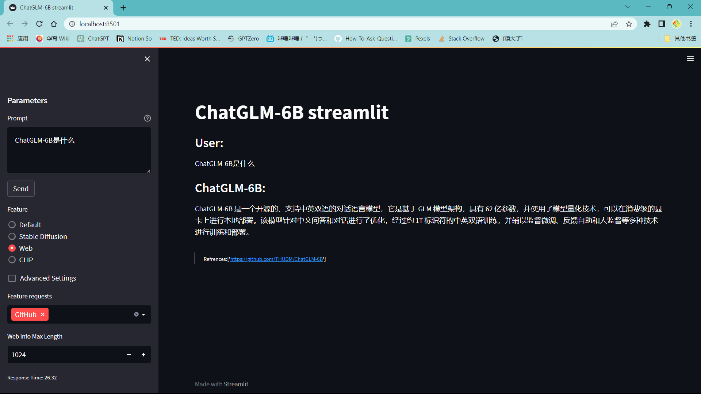
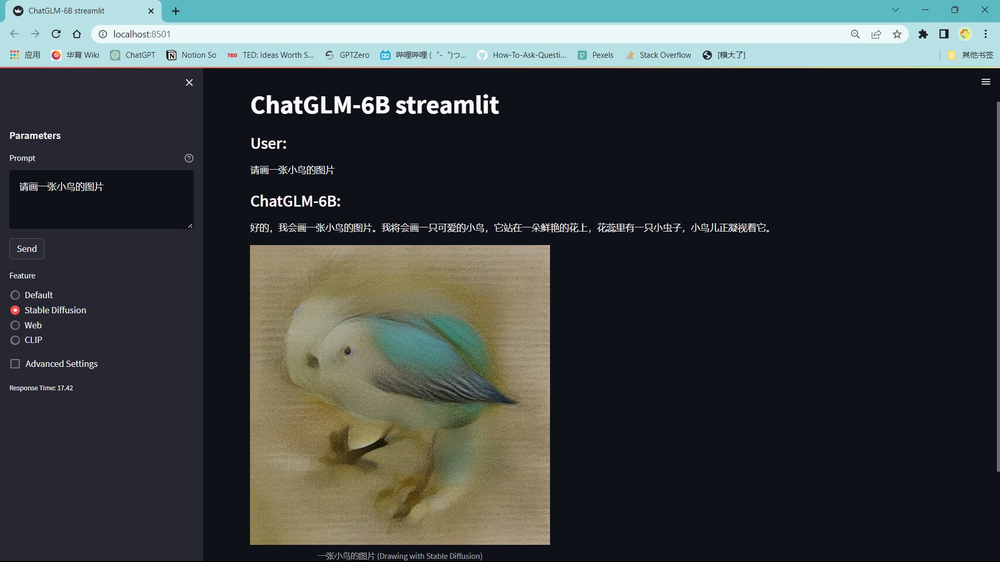
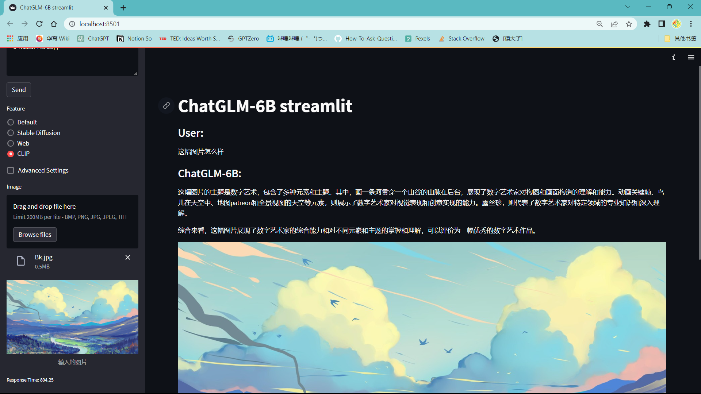

# 后端-模块-AI

## 介绍（暂未编写完成）

目前AI模块使用Python快速实现了基于ChatGLM的接口，配有示例网页，能提供和GPT3.5相近的聊天能力，并在配置满足时额外支持：网络搜索、图片绘制、图片分析


## 部署
安装依赖：
```powershell
pip install -r requirements.txt
```


## 运行
运行接口：
```powershell
python api.py
```

运行示例网页：

```powershell
streamlit run streamlit_new.py
```


图片绘制和图片分析能力需要部署 [Stable Diffusion](https://github.com/AUTOMATIC1111/stable-diffusion-webui)

因要求至少8G的显存+16G运行内存+40G软件大小，故在线开发环境暂不提供


## 功能

### 基本对话

可支持上下文对话



### 网络搜索



### 图片绘制

需要 [Stable Diffusion](https://github.com/AUTOMATIC1111/stable-diffusion-webui) 支持



### 图片分析

需要 [Stable Diffusion](https://github.com/AUTOMATIC1111/stable-diffusion-webui) 支持



## 错误排除

AssertionError: Torch not compiled with CUDA enabled

RuntimeError: CUDA error: no kernel image is available for execution on the device

请运行

```powershell
nvidia-smi
```

及

```powershell
nvcc -V
```

查看结果 如都正常无 error ，请运行

```python
import torch
print(torch.cuda.is_available())
```

**如返回为 True，**

请将在api.py中第57行

```python
model = AutoModel.from_pretrained("THUDM/chatglm-6b", trust_remote_code=True).quantize(4).half().cuda()
```

更改为

```python
model = AutoModel.from_pretrained("THUDM/chatglm-6b", trust_remote_code=True).half().cuda()
```

**如返回为 False**

请确认自己是否已安装gpu版本的torch

可参考网络教程

若设备无 nvidia 显卡，可参考 [Readme](https://github.com/THUDM/ChatGLM-6B/blob/main/README.md) 修改模型为 cpu 量化模型

## 引用

由ChatGLM-6B提供AI能力 https://github.com/THUDM/ChatGLM-6B